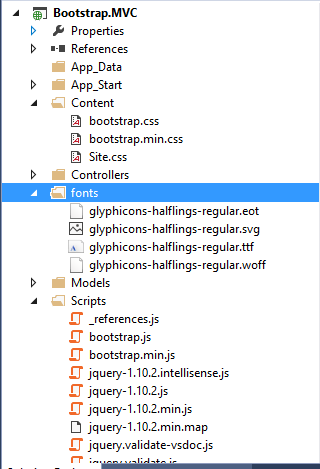
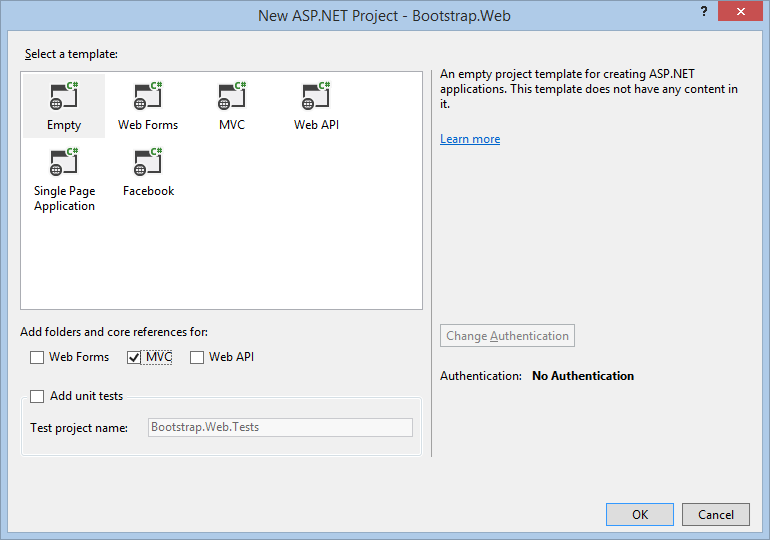
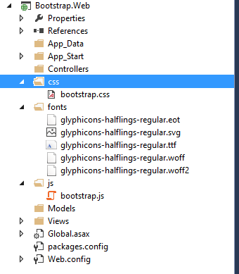
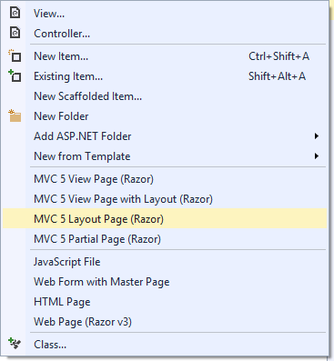
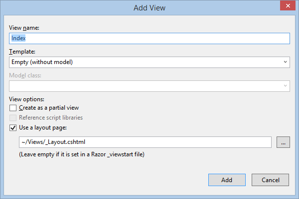
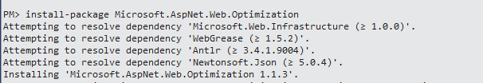
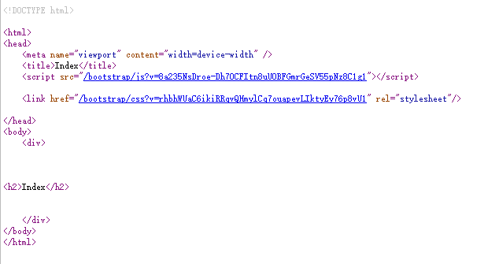

# ASP.NET MVC 随想录（1）——开始使用 Bootstrap 

> 作为一名 Web 开发者而言，如果不借助任何前端框架，从零开始使用 HTML 和 CSS 来构建友好的页面是非常困难的。特别是对于 Windows Form 的开发者而言，更是难上加难。
> 正是由于这样的原因，Bootstrap 诞生了。Twitter Bootstrap 为开发者提供了丰富的 CSS 样式、组件、插件、响应式布局等。同时微软已经完全集成在 ASP.NET MVC 模板中。

## Bootstrap 结构介绍

你可以通过.来下载最新版本的 Bootstrap。

解压文件夹后，可以看到 Bootstrap 的文件分布结构如下，包含 3 个文件夹：

css 文件夹中包含了 4 个.css 文件和 2 个.map 文件。我们只需要将 bootstrap.css 文件包含到项目里这样就能将 Bootstrap 应用到我们的页面中了。bootstrap.min.css 即为上述 css 的压缩版本。

.map 文件不必包含到项目里，你可以将其忽略。这些文件被用来作为调试符号（类似于Visual Studio 中的.pdb 文件），最终能让开发人员在线编辑预处理文件。

Bootstrap 使用 Font Awesome（一个字体文件包含了所有的字形图标，只为 Bootstrap 设计）来显示不同的图标和符号，fonts 文件夹包含了 4 类的不同格式的字体文件：

* Embedded OpenType (glyphicons-halflings-regular.eot)
* Scalable Vector Graphics (glyphicons-halflings-regular.svg)
* TrueType font (glyphicons-halflings-regular.ttf)
* Web Open Font Format (glyphicons-halflings-regular.woff)

建议将所有的字体文件包含在你的 Web 应用程序中，因为这能让你的站点在不同的浏览器中显示正确的字体。

> **EOT 字体格式文件需要 IE9 及以上浏览器支持，TTF 是传统的旧字体格式文件，WOFF 是从 TTF 中压缩得到的字体格式文件。如果你只需要支持 IE8 之后的浏览器、iOS 4 以上版本、同时支持 Android，那么你只需要包含 WOFF 字体即可。**

js 文件夹包含了 3 个文件，所有的 Bootstrap 插件被包含在 boostrap.js 文件中，bootstrap.min.js 即上述 js 的压缩版本，npm.js 通过项目构建工具 Grunt 自动生成。

在引用 boostrap.js 文件之前，请确保你已经引用了 JQuery 库因为所有的 Bootstrap 插件需要 JQuery。

## 在 ASP.NET MVC 项目中添加 Bootstrap 文件

打开 Visual Studio 2013，创建标准的 ASP.NET MVC 项目，默认情况下已经自动添加了 Bootstrap 的所有文件，如下所示：

说明微软对于 Bootstrap 是非常认可的，高度集成在 Visual Studio 中。

> **值得注意的是，在 Scripts 文件中添加了一个名为_references.js 的文件，这是一个非常有用的功能，当我们在使用 Bootstrap 等一些前端库时，它可以帮助 Visual Studio 启用智能提示。**

当然我们也可以创建一个空的 ASP.NET MVC 项目手动去添加这些依赖文件，正如下图所示这样，选择空的模板：

对于新创建的空白 ASP.NET MVC 项目来说，没用 Content，Fonts，Scripts 文件夹——我们必须手动去创建他们，如下所示：

当然，也可以用 Nuget 来自动添加 Bootstrap 资源文件。如果使用图形界面来添加 Bootstrap Nuget Package，则直接搜索 Bootstrap 即可；如果使用 Package Manager Console 来添加Bootstrap Nuget Package，则输入 Install-Package bootstrap。

## 为网站创建 Layout 布局页

为了让我们的网站保持一致的风格，我将使用 Bootstrap 来构建 Layout 布局页。在 Views 文件夹创建 MVC Layout Page(Razor)布局文件，如下图所示：

在新创建的 Layout 布局页中，使用如下代码来引用 Bootstrap 资源文件。  

    <link href="@Url.Content("~/css/bootstrap.css")" rel="stylesheet">
    

**其中使用 @Url.Content 会将虚拟或者相对路径转换为绝对路径，这样确保 Bootstrap 资源文件被引用。**

新建一个名为 Home 的 Controller，并且添加默认 Index 的视图，使其套用上述的 Layout 布局页面，如下所示:

## 使用捆绑打包和压缩来提升网站性能

捆绑打包(**bundling**)和压缩(**minification**)是 ASP.NET 中的一项新功能，允许你提升网站加载速度，这是通过限制请求 CSS 和 JavaScript 文件的次数来完成的。本质上是将这类文件结合到一个大文件以及删除所有不必要的字符（比如：注释、空格、换行）。

> **对于大多数现代浏览器访问一个主机名都有 6 个并发连接的极限，这意味着如果你在一张页面上引用了 6 个以上的 CSS、JavaScript 文件，浏览器一次只会下载 6 个文件。所以限制资源文件的个数是个好办法，真正意义上的使命必达，而不是浪费在加载资源上。**

## 在 Bootstrap 项目中使用捆绑打包

因为我们创建的是空的 ASP.NET MVC 项目，所以并没有自动引用与打包相关的程序集。打开 Nuget Package Manager Console 来完成对 Package 的安装，使用如下 PowerShell 命令：

install-package Microsoft.AspNet.Web.Optimization 来安装Microsoft.AspNet.Web.Optimization NuGet package 以及它依赖的 Package，如下所示：

  

在安装完成后，在 App_Start 中添加 BundleConfig 类：

    public static void RegisterBundles(BundleCollection bundles)
    {
       bundles.Add(new ScriptBundle("~/bootstrap/js").Include(
       "~/js/bootstrap.js",
       "~/js/site.js"));
       bundles.Add(new StyleBundle("~/bootstrap/css").Include(
       "~/css/bootstrap.css",
       "~/css/site.css"));
    }

ScriptBundle 和 StyleBundle 对象实例化时接受一个参数用来代表打包文件的虚拟路径，Include顾名思义将你需要的文件包含到其中。

然后在 Application_Start 方法中注册它：

    protected void Application_Start()
    {
       AreaRegistration.RegisterAllAreas();
       RouteConfig.RegisterRoutes(RouteTable.Routes);
       BundleConfig.RegisterBundles(BundleTable.Bundles);
       BundleTable.EnableOptimizations = true;
    }

**记住，不要去包含.min 类型的文件到打包文件中，比如 bootstrap.min.css、bootstrap.min.js，编译器会忽略这些文件因为他们已经被压缩过了。**

在 ASP.NET MVC 布局页使用 @Styles.Render("~/bootstrap/css")、@Scripts.Render("~/bootstrap/js")来添加对打包文件的引用。

如果 Visual Studio HTML 编辑器表明无法找到 Styles 和 Scripts 对象，那就意味着你缺少了命名空间的引用，你可以手动在布局页的顶部添加 System.Web.Optimization 命名空间，如下代码所示：  

    @using System.Web.Optimization
    <!DOCTYPE html>
    <html>
     <head>
      <meta name="viewport" content="width=device-width" />
      <title>@ViewBag.Title</title>
      @Scripts.Render("~/bootstrap/js")
      @Styles.Render("~/bootstrap/css")
     </head>
     <body>
      

       @*@RenderBody()*@
     

    </body>
    </html>

当然为了通用性，最佳的实践是在 Views 文件夹的 web.config 中添加 **System.Web.Optimization** 名称空间的引用，如下所示：  

    <namespaces>
      <add namespace="System.Web.Mvc" />
      <add namespace="System.Web.Mvc.Ajax" />
      <add namespace="System.Web.Mvc.Html" />
      <add namespace="System.Web.Routing" />
      <add namespace="Bootstrap.Web" />
      <add namespace="System.Web.Optimization" />
    </namespaces>

## 测试打包和压缩

为了使用打包和压缩，打开网站根目录下的 web.config 文件，并且更改 compilation 元素的 dubug 属性为 false，即为 release。

当然你可以在 Application_Start 方法中设置 BundleTable.EnableOptimizations = true 来同样达到上述效果（它会 override web.config 中的设置，即使 debug 属性为 true）。

最后浏览网页，查看源代码，可以清楚看到打包文件的路径是之前定义过的相对路径，点击这个链接，浏览器为我们打开了经过压缩处理过后的打包文件，如下图所示：

## 小结

> 在这一章节中，简单为大家梳理了 Bootstrap 的体系结构，然后怎样在 ASP.NET MVC 项目中添加 Bootstrap，最后使用了打包和压缩技术来实现对资源文件的打包，从而提高了网站的性能。
