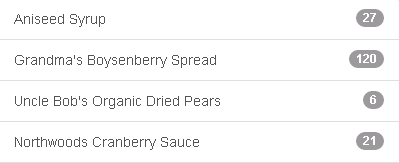
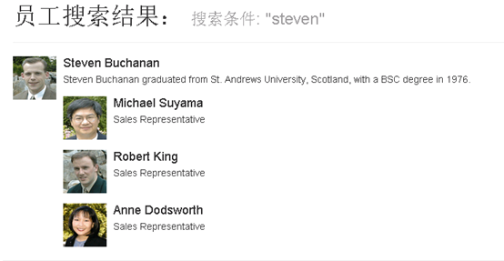
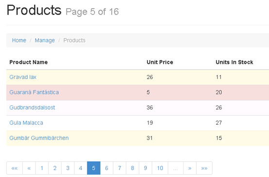
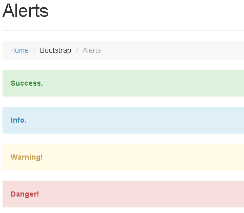
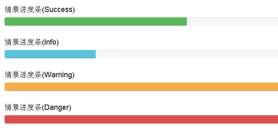

# ASP.NET MVC 随想录（3）——使用 Bootstrap 组件 

> Bootstrap 为我们提供了十几种的可复用组件，包括字体图标、下拉菜单、导航、警告框、弹出框、输入框组等。在你的 Web Application 中使用这些组件，将为用户提供一致和简单易用的用户体验。
> 
> Bootstrap 组件本质上是结合了各种现有 Bootstrap 元素以及添加了一些独特 Class 来实现。Bootstrap 元素我在上一篇文章中涉及到。在这篇博客中，我将继续探索 Bootstrap 丰富的组件以及将它结合到 ASP.NET MVC 项目中。

## Bootstrap 导航条

Bootstrap 导航条作为"明星组件"之一，被使用在大多数基于 Bootstrap Framework 的网站上。为了更好的展示 Bootstrap 导航条，我在 ASP.NET MVC 的_Layout.cshtml 布局页创建一个 fixed-top 导航条，当然它是响应式的——在小尺寸、低分辨率的设备上打开时，它将会只展示一个按钮并带有 3 个子菜单，当点击按钮时垂直展示他们。在网页上显示如下：

在移动设备上显示如下：

在 ASP.NET MVC默认的_Layouts.cshtml 布局页中已经帮我们实现了上述功能，打开它对其稍作修改，如下代码片段所示：

    

        

            

                <button type="button" class="navbar-toggle" data-toggle="collapse" data-target=".navbar-collapse">

                

                

                

                </button>

                @Html.ActionLink("Northwind Traders", "Index", "Home", null, new { @class = "navbar-brand" })

            

            

                @Html.Partial("_BackendMenuPartial")

                @Html.Partial("_LoginPartial")

            

        

    

其中 class为.navbar-fixed-top 可以让导航条固定在顶部，还可包含一个 .container 或 .container-fluid 容器，从而让导航条居中，并在两侧添加内补（padding）

**注意，我使用了 2 个局部视图（_BackendMenuPartial 和 LoginPartial）来生成余下的导航条（使用.navbar-collapse 类在低分辨率设备中折叠），其中局部视图逻辑是基于当前访问的用户是否登陆来控制是否显示。**

首先，添加如下代码在_BackendMenuPartial 视图中，这将会在导航条中产生一个搜索框：

    @using (Html.BeginForm("Index", "Search", FormMethod.Post, new { @class = "navbar-form navbar-left", role = "search" }))  
    {

        

            @Html.TextBox("searchquery", "", new { @id = "searchquery", @class = "form-control input-sm", placeholder = "Search" })

            @Html.Hidden("fromcontroller", @ViewContext.RouteData.Values["controller"], new { @id = "fromcontroller" })

        

        <button type="submit" class="btn btn-default btn-xs">GO</button>

    }

因为 Bootstrap 导航条作为整个网站的公共部分，要实现快速搜索那么必须要知道当前所处于哪个 Controller，这样才能提高检索效率。所以上述代码中，增加了一个 Id 为 _**fromcontroller**_ 隐藏字段，代表当前访问的 Controller。

当点击搜索时，发送 HTTP POST 请求到 Index Action 下。然后根据传递过来的 fromcontroller 来 swith 到具体的 Action 来执行搜索，具体的搜索逻辑代码如下：

    public ActionResult Index(string searchquery, string fromcontroller)

    {

        switch (fromcontroller)

        {

            case "Products":

            return RedirectToAction("SearchProductsResult", new { query = searchquery });

            case "Customers":

            return RedirectToAction("SearchCustomersResult", new { query = searchquery });

            case "Employees":

            return RedirectToAction("SearchEmployeesResult", new { query = searchquery });

        }

        return View();

    }

具体搜索的 Action 如下：

    public ActionResult SearchProductsResult(string query)

    {

        ViewBag.SearchQuery = query;

        var results = _context.Products.Where(p => p.ProductName.Contains(query)).ToList();

        return View(results);

    }

    public ActionResult SearchCustomersResult(string query)

    {

        ViewBag.SearchQuery = query;

        var results = _context.Customers.Where(p => p.CompanyName.Contains(query)

        || p.ContactName.Contains(query)

        || p.City.Contains(query)

        || p.Country.Contains(query)).ToList();

        return View(results);

    }

    public ActionResult SearchEmployeesResult(string query)

    {

        ViewBag.SearchQuery = query;

        var results = _context.Employees.Where(p => p.FirstName.Contains(query)

        || p.LastName.Contains(query)

        || p.Notes.Contains(query)).ToList();

        return View(results);

    }

## 列表组

列表组是灵活又强大的组件，不仅能用于显示一组简单的元素，还能结合其他元素创建一组复杂的定制内容。上面的搜索为我们重定向到 Result 视图，在此视图中，它为我们显示了搜索结果，为了更好的展示结果，我们可以使用列表组来显示搜索到的产品，视图中的代码如下所示：

    @model IEnumerable<bootstrap.data.models.products>

    @{

        ViewBag.Title = "搜索产品";

    }

    

        

            <h1>产品结果 <small>搜索条件: "@ViewBag.SearchQuery"</small></h1>

        

        <ul class="list-group">

            @foreach (var item in Model)

            {

            <a href="@Url.Action("edit","products",new={ id=@item.ProductID})class="list-group-item">@item.ProductName @item.UnitsInStock</a>

            }

        </ul>

    

在上述代码中，为无序列表 ul 的 class 设置为 list-group，并且每一个li的 class 为 list-group-item，这是一个最简单的列表组。

## 徽章

徽章用来高亮条目，可以很醒目的显示新的或者未读的条目数量，为一个元素设置徽章仅仅只需要添加元素并设置它的 class为badge。所以，在上述代码的基础上稍作修改，添加徽章，表示库存个数，如下 HTML 所示：

    <a href="@Url.Action("edit","products",="" new={id="@item.ProductID}) class="list-group-item">
        @item.ProductName @item.UnitsInStock
    </a>

显示的结果为如下截图：

## 媒体对象

媒体对象组件被用来构建垂直风格的列表比如博客的回复或者推特。在 Northwind 数据库中包含一个字段 ReportTo 表 示Employee 向另一个 Employee Report。使用媒体对象可以直观来表示这种关系。在视图中的代码如下所示：

    

    

        <h1>员工搜索结果： <small>搜索条件: "@ViewBag.SearchQuery"</small></h1>

    

    @foreach (var item in Model)

    {

        

            

            

                <h4 class="media-heading">@item.FirstName @item.LastName</h4>

                @item.Notes

                @foreach (var emp in @item.ReportingEmployees)

                {

                    

                        

                        

                            <h4 class="media-heading">@emp.FirstName @emp.LastName</h4>

                            @emp.Title

                        

                    

                }

            

        

    }

    

显示结果如下：

可以看到，媒体对象组件是由一系列 class 为 media、media-heading、media-body、media-object 的元素组合而成，其中 media-object 用来表示诸如图片、视频、声音等媒体对象。

注：.pull-left&nbsp;和&nbsp;.pull-right&nbsp;这两个类以前也曾经被用在了媒体组件上，但是，从 v3.3.0 版本开始，他们就不再被建议使用了。.media-left&nbsp;和&nbsp;.media-right&nbsp;替代了他们，不同之处是，在 html 结构中，&nbsp;.media-right&nbsp;应当放在&nbsp;.media-body&nbsp;的后面。

## 页头

当用户访问网页时，Bootstrap 页头可以为用户提供清晰的指示。Bootstrap 页头本质上是一个元素被封装在 class为page-header 的
元素中。当然你也可以利用<small>元素来提供额外的关于页面的信息，同时 Bootstrap 为页头添加了水平分隔线用于分隔页面，如下 HTML 即为我们构建了页头：

    

        <h1>员工搜索结果： <small>搜索条件: "@ViewBag.SearchQuery"</small></h1>

    

## 路径导航

路径导航（面包屑）在 Web 设计中被用来表示用户在带有层次的导航结构中当前页面的位置。类似于 Windows 资源管理器。如下 HTML 所示：

    <ol class="breadcrumb">

        <li>@Html.ActionLink("Home", "Index", "Home")</li>

        <li>@Html.ActionLink("Manage", "Index", "Manage")</li>

        <li class="active">Products</li>

    </ol>

在上面 HTML 代码中，通过指定有序列表 ol 的 class 为 breadcrumb，每一个子路径用 li 来表示，其中通过设置li的 class 为 active 代表当前所处的位置。

各路径间的分隔符已经自动通过 CSS 的&nbsp;:before&nbsp;和&nbsp;content&nbsp;属性添加了。

## 分页

分页用来分隔列表内容，特别是显示大量数据时通过分页可以有效的减少服务器压力和提高用户体验，如下截图使用分页来显示产品列表：

要完成上述的分页，需要安装 PagedList.Mvc 程序包，在 NuGet 控制台中安装即可：Install-PackagePagedList.Mvc

然后修改 Action，它需要接受当然的页码，它是一个可空的整数类型变量，然后设置 PageSize 等于5，表示每页显示 5 条记录，如下代码所示：

    public ActionResult Index(int? page)

    {

        var models = _context.Products.Project().To<productviewmodel>().OrderBy(p => p.ProductName);

        int pageSize = 5;

        int pageNumber = (page ?? 1);

        return View(models.ToPagedList(pageNumber, pageSize));

    }

## 输入框组

输入框组为用户在表单输入数据时可以提供更多的额外信息。Bootstrap 的输入框组为我们在 Input 元素的前面或者后面添加指定 class 的块，这些块可以是文字或者字体图标，如下所示：

    

        

            

                

            

            @Html.TextBox("txtPhone","1194679215",new { @class = "form-control" })

        

    

上面的输入框组合中，在 Textbox 的左边放置了一个带有字体图标 Phone 的灰色块，结果如下所示：

不仅可以使用字体图标，还可以使用纯文本来显示信息，如下所示在 Textbox 右边放置了固定的邮箱域名：

    

        

            @Html.TextBox("txtEmail","1194679215", new { @class = "form-control" })

            @@qq.com

        

    

当然也可以在 Input 元素的两边同时加上块，如下代码所示:

    

        

            ￥

                @Html.TextBox("txtMoney","100",new { @class = "form-control" })

            .00

        

    

## 按钮式下拉菜单

按钮式下拉菜单顾名思义，一个按钮可以执行多种 action，比如既可以 Save，也可以 Save 之后再打开一个新的 Form 继续添加记录，如下所示：

    

        

            

                <button type="submit" class="btn btn-primary btn-sm">Save</button>

                <button type="button" class="btn btn-primary btn-sm dropdown-toggle" data-toggle="dropdown">

                    

                    Toggle Dropdown

                </button>

                <ul class="dropdown-menu" role="menu">

                    <li><a href="#" id="savenew">Save &amp; New</a></li>

                    <li class="divider"></li>

                    <li><a href="#" id="duplicate">Duplicate</a></li>

                </ul>

            

        

    

## 警告框

Bootstrap 警告组件通常被用作给用户提供可视化的反馈，比如当用户 Save 成功后显示确认信息、错误时显示警告信息、以及其他的提示信息。

Bootstrap 提供了 4 种不同风格的警告，如下所示：

    

        

            <h1>Alerts </h1>

        

        <ol class="breadcrumb">

            <li>@Html.ActionLink("Home", "Index", "Home")</li>

            <li>Bootstrap</li>

            <li class="active">Alerts</li>

        </ol>

        
<strong>Success. </strong>

        
<strong>Info.</strong>

        
<strong>Warning!</strong>

        
<strong>Danger!</strong>

    

可关闭的警告框可以让用户点击右上角的 X 来关闭，你可以使用 alter-dismissible 类：

    

        <button type="button" class="close" data-dismiss="alert">

            ×Close

        </button>

        <strong>Alert!</strong>这是可关闭的Alter

    

## 进度条  

进度条在传统的桌面应用程序比较常见，当然也可以用在 Web 上。通过这些简单、灵活的进度条，可以为当前工作流程或动作提供实时反馈。Bootstrap 为我们提供了许多样式的进度条。

基本进度条是一种纯蓝色的进度条，添加一个 class 为 sr-only 的元素在进度条中是比较好的实践，这样能让屏幕更好的读取进度条的百分比。

    

    
    <h4>基本进度条</h4>

    

        

            80%完成

        

    

    

  

上下文情景变化进度条使用与按钮和警告框相同的类，根据不同情境展现相应的效果

- progress-bar-success
- progress-bar-info
- progress-bar-warning
- progress-bar-danger

  

条纹动画效果进度条，为了让进度条更加生动，可以为其添加条纹效果，在进度条 div 中添加 class 为progress-striped。当然让进度条看起来有动画，可以再为其指定active的class在div上，如下所示：  

    

    

        40% 完成 (success)

    

    

  

## 小结 ##

在这篇文章中，探索了Bootstrap中丰富的组件，并将它结合到ASP.NET MVC项目中。通过实例可以发现，这类组件本质上是结合了各种现有Bootstrap元素以及添加了一些独特Class来实现。