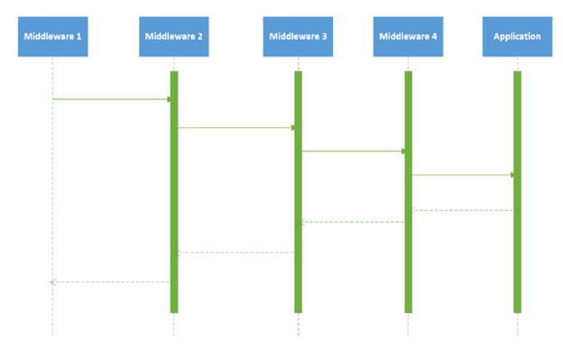
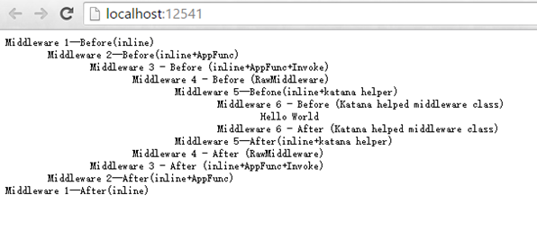

# ASP.NET MVC 随想录（8）——创建自定义的 Middleware 中间件

 经过前 2 篇文章的介绍，相信大家已经对 OWIN 和 Katana 有了基本的了解，那么这篇文章我将继续OWIN 和 Katana 之旅——创建自定义的 Middleware 中间件。

## 何为 Middleware 中间件

Middleware 中间件从功能上可以理解为用来处理 Http 请求，当 Server 将 Http 请求封装成符合 OWIN 规范的字典后，交由 Middleware 去处理，一般情况下， Pipeline 中的 Middleware 以链式的形式处理 Http 请求，即每一个 Middleware 都是最小的模块化，彼此独立、高效。

从语法上理解 Middleware 的话，他是一个应用程序委托（`Func<IDictionary<string,object>, Task>`）的实例，通过使用 IAppBuilder 接口的 Use 或者 Run 方法将一个 Middleware 插入到 Pipeline 中，不同的是使用 Run 方法不需要引用下一个 Middleware，即他是 Pipeline 中最后的处理元素。

## 使用 Inline 方式注册 Middleware

使用 Use 方法可以将一个 Middleware 插入到 Pipeline 中，值得注意的是需要传入下一个 Middleware 的引用，代码如下所示：  

    app.Use(new Func<Func<IDictionary<string, object>, Task>/*Next*/,
     Func<IDictionary<string, object>/*Environment Dictionary*/, Task>>(next => async env =>
     {
    	 string before = "Middleware1--Before(inline)"+Environment.NewLine;
    	 string after = "Middleware1--After(inline)"+Environment.NewLine;
    	 var response = env["owin.ResponseBody"] as Stream;
    	 await response.WriteAsync(Encoding.UTF8.GetBytes(before), 0, before.Length);
    	 await next.Invoke(env);
    	 await response.WriteAsync(Encoding.UTF8.GetBytes(after), 0, after.Length);
     }));

上述代码中，实例化了一个委托，它需要传入下一个 Pipeline 中的 Middleware 引用同时返回一个新的 Middleware 并插入到 Pipeline 中。因为是异步的，所以别忘了 async、await 关键字。

## 使用 Inline+ AppFunc 方式注册 Middleware

为了简化书写，我为应用程序委托（`Func<IDictionary<string,object>, Task>`）类型创建了别名 AppFunc：

 `using AppFunc=Func<IDictionary<string,object>/*Environment Dictionary*/,Task/*Task*/>;`

所以又可以使用如下方式来讲 Middleware 添加到 Pipeline 中：

    app.Use(new Func<AppFunc, AppFunc>(next => async env =>
    {
	    string before = "\tMiddleware2--Before(inline+AppFunc)" + Environment.NewLine;
	    
	    string after = "\tMiddleware2--After(inline+AppFunc)" + Environment.NewLine;
	    
	    var response = env["owin.ResponseBody"] as Stream;
	    
	    await response.WriteAsync(Encoding.UTF8.GetBytes(before), 0, before.Length);
	    
	    await next.Invoke(env);
	    
	    await response.WriteAsync(Encoding.UTF8.GetBytes(after), 0, after.Length);
    
    }));

考虑到业务逻辑的增长，有必要将 Lambda 表达式中的处理逻辑给分离开来，所以对上述代码稍作修改，提取到一个名为 Invoke 的方法内：

    app.Use(new Func<AppFunc, AppFunc>(next => env => Invoke(next, env)));
    private async Task Invoke(Func<IDictionary<string, object>, Task> next, IDictionary<string, object> env)
    {
    
	    var response = env["owin.ResponseBody"] as Stream;
	    
	    string pre = "\t\tMiddleware 3 - Before (inline+AppFunc+Invoke)" + Environment.NewLine;
	    
	    string post = "\t\tMiddleware 3 - After (inline+AppFunc+Invoke)" + Environment.NewLine;
	    
	    await response.WriteAsync(Encoding.UTF8.GetBytes(pre), 0, pre.Length);
	    
	    await next.Invoke(env);
	    
	    await response.WriteAsync(Encoding.UTF8.GetBytes(post), 0, post.Length);
    
    }

虽然将业务逻辑抽取到一个方法中，但 Inline 这种模式对于复杂的 Middleware 还是显得不够简洁、易懂。我们更倾向于创建一个单独的类来表示。

## 定义原生 Middleware 类的形式来注册 Middleware

如果你只想简单的跟踪一下请求，使用 Inline 也是可行的，但对于复杂的 Middleware，我倾向于创建一个单独的类，如下所示：

    public class RawMiddleware
    {
	      private readonly AppFunc _next;
	      public RawMiddleware(AppFunc next)
	      {
	      	this._next = next;
	      }
	    
	      public async Task Invoke(IDictionary<string,object> env )
	      {
		      var response = env["owin.ResponseBody"] as Stream;
		    
		      string pre = "\t\t\tMiddleware 4 - Before (RawMiddleware)" + Environment.NewLine;
		    
		      string post = "\t\t\tMiddleware 4 - After (RawMiddleware)rn" + Environment.NewLine;
		    
		      await response.WriteAsync(Encoding.UTF8.GetBytes(pre), 0, pre.Length);
		    
		      await _next.Invoke(env);
		    
		      await response.WriteAsync(Encoding.UTF8.GetBytes(post), 0, post.Length);
	    
	      }
    
      }

最后，依旧是通过 Use 方法来将 Middleware 添加到 Pipeline 中：

    //两者方式皆可
    //app.Use<rawmiddleware>();
    app.Use(typeof (RawMiddleware));

上述代码中，IAppBuilder 实例的 Use 方法添加 Middleware 至 Pipeline 与 Inline 方式有很大不同，它接受一个 Type 而非 Lambda 表达式。在这种情形下，创建了一个 Middleware 类型的实例，并将 Pipeline 中下一个 Middleware 传递到构造函数中，最后当 Middleware 被执行时调用 Invoke 方法。

>  注意 Middleware 是基于约定的形式定义的，需要满足如下条件：
> 	
> * **构造函数的第一个参数必须是 Pipeline 中下一个 Middleware** 
> * **必须包含一个 Invoke 方法，它接收 Owin 环境字典，并返回 Task**

## 使用Katana Helper来注册Middleware

程序集 Microsoft.Owin 包含了 Katana 为我们提供的 Helper，通过他，可以简化我们的开发，比如 IOwinContext 封装了 Owin 的环境字典，强类型对象可以通过属性的形式获取相关数据，同时为 IAppBuilder 提供了丰富的扩展方法来简化 Middleware 的注册，如下所示：

    app.Use(async (context, next) =>
       {
       await context.Response.WriteAsync("\t\t\t\tMiddleware 5--Befone(inline+katana helper)"+Environment.NewLine);
    
       await next();
    
       await context.Response.WriteAsync("\t\t\t\tMiddleware 5--After(inline+katana helper)"+Environment.NewLine);
    
       });

当然我们也可以定义一个 Middleware 类并继承 OwinMiddleware，如下所示：

    public class MyMiddleware : OwinMiddleware
    {
       public MyMiddleware(OwinMiddleware next)
       : base(next)
       {
    
     
    
       }
    
       public override async Task Invoke(IOwinContext context)
       {
	       await context.Response.WriteAsync("tttttMiddleware 6 - Before (Katana helped middleware class)"+Environment.NewLine);
	    
	       await this.Next.Invoke(context);
	    
	       await context.Response.WriteAsync("tttttMiddleware 6 - After (Katana helped middleware class)"+Environment.NewLine);
    
       }
    
      }
然后将其添加到 Pipeline 中：

     app.Use<mymiddleware>();

## Middleware 的执行顺序

在完成上面 Middleware 注册之后，在 Configuration 方法的最后添加最后一个的 Middleware 中间件，注意它并不需要对下一个 Middleware 的引用了，我们可以使用 Run 方法来完成注册：

    app.Run(context=>context.Response.WriteAsync("\t\t\t\t\t\tHello World"+Environment.NewLine));

值得注意的是，Pipeline 中 Middleware 处理 Http Request 顺序同注册顺序保持一致，即和 Configuration 方法中书写的顺序保持一致，Response 顺序则正好相反，如下图所示：

最后，运行程序，查看具体的输出结果是否和我们分析的保持一致：

## 小结

> 在这篇文章中，我为大家讲解了有关自定义 Middleware 的创建的相关知识，Katana 为我们提供了非常多的方式来创建和注册 Middleware，在下一篇文章中，我将继续为大家讲解 OWIN 和 Katana 的其他知识，和大家一起探索 Katana 和其他 Web Framework 的集成。

